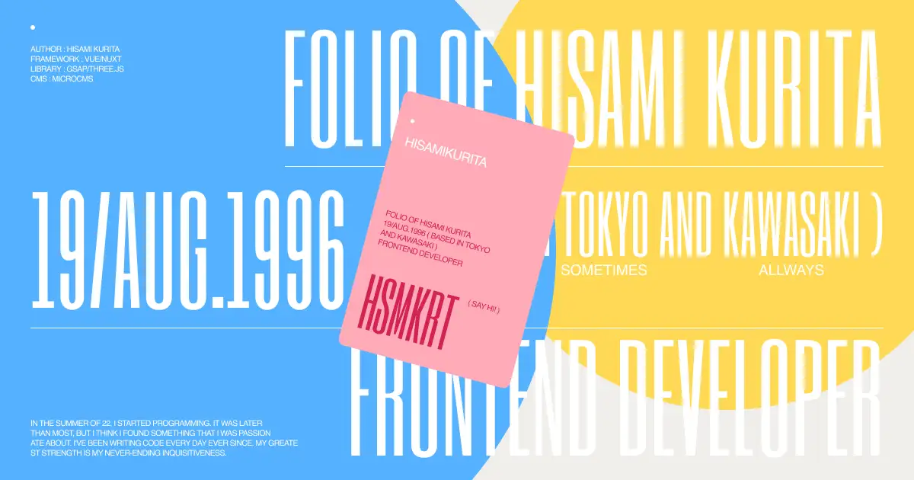

# hisamikurita-portfolio

## Technorogy

### Front End

Framework : [Vue.js](https://jp.vuejs.org/index.html), [Nuxt.js](https://nuxtjs.org/) 
Library : [Three.js](https://threejs.org/), [GSAP](https://greensock.com/gsap/), [ASSCROLL](https://github.com/ashthornton/asscroll), [imagesLoaded](https://imagesloaded.desandro.com/)

### Back End

Cms : [microCMS](https://microcms.io/)

### HOSTING

Hosting : [AWS Amplify](https://aws.amazon.com/jp/amplify/hosting/)

## Overview

This is the repository of [Hisami Kurita](https://hsmkrt1996.com/) portfolio. This site was created using Vue.js/Nuxt.js, but since this was my first attempt, there is a lot of redundant code that is not best practice. If you use it as a reference, please be very careful.

## Award

- [Awwwwards SOTD & DEVAWARD](https://www.awwwards.com/sites/hisami-kurita-portfolio/)
- [CSSDesignAwards WOTD](https://www.cssdesignawards.com/sites/hisami-kurita-portfolio/41510/)
- [FWA FOTD](https://thefwa.com/cases/hisami-kurita-portfolio)
- [Nominated for DEVELOPER OF THE YEAR 2022](https://annual.awwwards.com/developer-nominees/hisami-kurita-portfolio)

Thank You.
